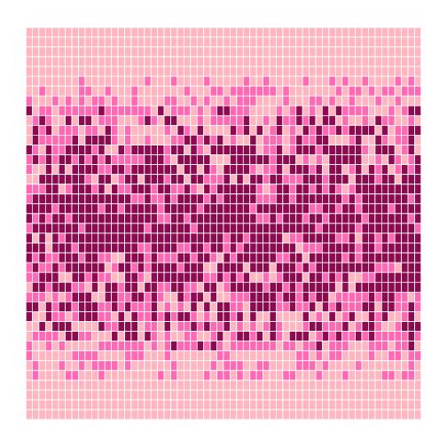
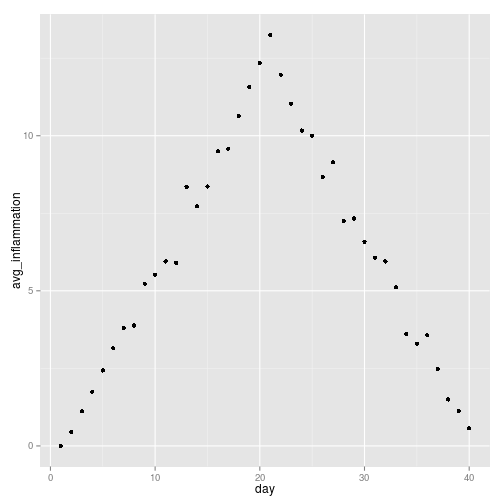

# Analyzing Multiple Data Sets

We have created a function called analyze that creates graphs of the minimum, average, and maximum daily inflammation rates for a single data set:


```r
analyze <- function(filename) {
    data <- read.csv(filename)
    
    avg_inflammation <- apply(data, 2, mean)
    max_inflammation <- apply(data, 2, max)
    min_inflammation <- apply(data, 2, min)
    day <- c(1:ncol(data))
    
    plot(day, avg_inflammation)
    plot(day, min_inflammation)
    plot(day, max_inflammation)
}

analyze("data/inflammation-01.csv")
```

   


We can use it to analyze other data sets one by one:


```r
analyze("data/inflammation-02.csv")
```

   


but we have a dozen data sets right now and more on the way.
We want to create plots for all our data sets with a single statement.
To do that, we'll have to teach the computer how to repeat things.

## Objectives

* Explain what a `for` loop does.
* Correctly write for loops to repeat simple calculations.
* Trace changes to a loop variable as the loop runs.
* Trace changes to other variables as they are updated by a for loop.
* Explain what a list is.
* Create and index lists of simple values.
* Use a library function to get a list of filenames that match a simple wildcard pattern.
* Use a for loop to process multiple files.

## For Loops

Suppose we want to convert a bunch of temperatures in Fahrenheit to Celsius. One way is to use separate function calls:


```
## Error: could not find function "fahr_to_celsius"
```

```
## Error: could not find function "fahr_to_celsius"
```

```
## Error: could not find function "fahr_to_celsius"
```


but that's a bad approach for two reasons:

It doesn't scale: if we want to convert hundreds of temperatures, it would require typing in hundreds of function calls.

It is not reproducible: if we give it a longer vector, it only prints part of the data, and if we give it a shorter one, it produces an error or gives us `NA` values because we're asking for elements that don't exist.

Here's a better approach:


```r
loop_fahr_to_celsius <- function(temperatures) {
    # Converts a vector of Fahrenheit temperatures to Celsius
    for (i in 1:length(temperatures)) {
        print(fahr_to_celsius(temperatures[i]))
    }
}
```


```r
loop_fahr_to_celsius(temps)
```

```
## Error: could not find function "fahr_to_celsius"
```


This is shorter and more robust as well:


```r
loop_fahr_to_celsius(1000)
```

```
## Error: could not find function "fahr_to_celsius"
```

```r
loop_fahr_to_celsius(c(temps, temps + 10))
```

```
## Error: could not find function "fahr_to_celsius"
```


The improved version of `loop_fahr_to_celsius` uses a `for loop` to repeat an operation---in this case, printing---once for each thing in a collection. The general form of a loop is:


```r
for (variable in collection){
	do things with variable
}
```


We can call the loop variable(s) anything we like, but there must be a curly brace `{` at the end of the line starting the loop, and we should indent the body of the loop.

Here's another loop that repeatedly updates a variable:


```r
len <- 0
for (vowel in 1:nchar("aeiou")) {
    len = len + 1
    print(paste("There are", len, "vowels"))
}
```


It's worth tracing the execution of this little program step by step. Since there are five characters in 'aeiou', the `print` statement will be executed five times. The first time around, length is zero (the value assigned to it on line 1) and vowel is 'a'. The statement adds 1 to the old value of length, producing 1, and updates length to refer to that new value. The next time around, vowel is 'e' and length is 1, so length is updated to be 2. After three more updates, length is 5; since there is nothing left in 'aeiou' for R to process, the loop finishes and the `print` statement tells us our final answer.

Note also that finding the length of a string is such a common operation that R actually has a built-in function to do it called len:


```r
nchar("aeiou")
```


`nchar` is much faster than any function we could write ourselves, and much easier to read than a two-line loop.

### Challenges

1. Rewrite our `loop_fahr_to_celsius` function so that instead of printing the results to the screen, it will `return()` them to a new vector.

2. Exponentiation is built into R: `2**4`. Write a function called expo that uses a loop to calculate the same result.

3. We can also apply some simple methods to R vectors. One of these is called `sort`. It works on numbers or letters: 


```r
sort(words)
```

```
## Error: object 'words' not found
```

```r
sort(words, decreasing = TRUE)
```

```
## Error: object 'words' not found
```


Write a function called rev that does the same thing. As always, be sure to include a docstring.

## Lists

In R lists act as containers for multiple types of data. A list is a special type of vector. Each element can be a different type.
Unlike atomic vectors, the contents of a list are not restricted to a single mode and can encompass any mixture of data types. 
Lists are sometimes called recursive vectors, because a list can contain other lists, this makes them fundamentally different from atomic vectors. 

Create lists using `list()` or coerce other objects using `as.list()`


```r
x <- list(1, "a", TRUE, 1 + (0+4i))
x
```


```r
x <- 1:10
x <- as.list(x)
length(x)
```


What is the class of `x[1]`? How about `x[[1]]`?


```r
xlist <- list(a = "Software Carpentry", b = 1:10, data = head(iris))
xlist
```


What is the length of this object? What about its structure?

A list can contain many lists nested inside.


```r
ylist <- list(list(list(list())))
ylist
```


```r
is.recursive(ylist)
```


Lists are extremely useful inside functions. 
You can "staple" together lots of different kinds of results into a single object that a function can return.

A list does not print to the console like a vector. Instead, each element of the list starts on a new line.

Elements are indexed by double brackets. Single brackets will still return a(nother) list.

# Changes

Data that can be changed is called mutable, while data that cannot be is called immutable. 
Like strings, numbers are immutable: there's no way to make the number 0 have the value 1 or vice versa.
Vectors, data frames, and matrices, on the other hand, are mutable: they can be modified after they have been created.

Programs that modify data in place can be harder to understand than ones that don't because readers may have to mentally sum up many lines of code in order to figure out what the value of something actually is. 
On the other hand, programs that modify data in place instead of creating copies that are almost identical to the original every time they want to make a small change are much more efficient.
There are many ways to change the contents besides assigning to elements:


```r
odds <- c(1, 3, 5, 7, 9)
odds <- c(odds, 13)
odds <- odds + 1
odds <- odds[-1]
odds <- sort(odds, decreasing = TRUE)
```


Challenges
-------------

1. Write a function called total that calculates the sum of the values in a list. (R has a built-in function called `sum` that does this for you. Please don't use it for this exercise.)


```r
total <- function(vector) {
    # calculates the sum of the values in a vector
    vector_sum <- 0
    for (i in 1:length(vector)) {
        vector_sum <- vector_sum + vector[i]
    }
    vector_sum
}
```


# Processing Multiple Files

We now have almost everything we need to process all our data files.

What we need is a function that finds files whose names match a pattern.
We provide those patterns as strings: the character * matches zero or more characters, while ? matches any one character.
We can use this to get the names of all the R files we have created so far:


```r
list.files(pattern = "*.R")
```


or to get the names of all our CSV data files:


```r
list.files(pattern = "*.csv", recursive = TRUE)
```


As these examples show, `list.files()` results in a character vector, which means we can loop over it to do something with each filename in turn.
In our case, the "something" we want is our analyze function. Let's test it by analyzing the first three files in the list:


```r
filenames <- list.files(pattern = "*.csv", recursive = TRUE)
filenames <- filenames[1:3]

for (f in 1:length(filenames)) {
    print(filenames[f])
    analyze(filenames[f])
}
```

         


Sure enough, the maxima of these data sets show exactly the same ramp as the first, and their minima show the same staircase structure.

### Challenges

1. Write a function called `analyze_all` that takes a filename pattern as its sole argument and runs analyze for each file whose name matches the pattern.

## Key Points

* Use `for variable in collection` to process the elements of a collection one at a time.
* The body of a for loop does not have to, but should be indented.
* Use `length(thing)` to determine the length of something that contains other values.
* c(value1, value2, value3, …) creates a vector
* Vectors are indexed and sliced in the same way as strings and arrays.
* vectors are mutable (i.e., their values can be changed in place).
* Use `list.files(pattern)` to create a list of files whose names match a pattern.
* Use `*` in a pattern to match zero or more characters.


## Next Steps

We have now solved our original problem: we can analyze any number of data files with a single command. More importantly, we have met two of the most important ideas in programming:

* Use functions to make code easier to re-use and easier to understand.
* Use vectors and arrays to store related values, and loops to repeat operations on them.
